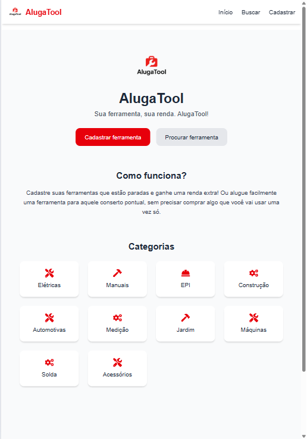

# 🛠️ AlugaTool

**Sua ferramenta, sua renda.**  
Uma plataforma de aluguel de ferramentas entre pessoas, construída com **Next.js 14**, **Tailwind CSS**, **TypeScript**, **Firebase**, e **Framer Motion**.

[](https://vercel.com/)
[](https://github.com/robsonalbuquerquedev)
[](https://nextjs.org)
[](https://tailwindcss.com/)
[](https://firebase.google.com/)

---

## 🔍 Visão Geral

O **AlugaTool** é um marketplace de aluguel de ferramentas onde:

- Usuários podem **cadastrar ferramentas que possuem**.
- Outros usuários podem **alugar essas ferramentas por um período**.
- O dono da ferramenta gera renda, o locatário economiza.

É uma solução pensada para eletricistas, pedreiros, hobbystas ou qualquer pessoa que só precisa de uma ferramenta pontualmente.

---

## 🖼️ Preview

> Em breve: link do site hospedado (via Vercel)



---

## 🚀 Tecnologias utilizadas

- ⚛️ Next.js 14 (App Router)
- 💅 Tailwind CSS
- 🔐 Firebase Auth
- 🔥 Firebase Realtime Database
- 🎨 React Icons
- 🧠 Framer Motion (animações)
- 🌐 TypeScript

---

## 📦 Como rodar o projeto localmente

```bash
# 1. Clone este repositório
git clone https://github.com/robsonalbuquerquedev/aluga-tool.git

# 2. Acesse a pasta do projeto
cd aluga-tool

# 3. Instale as dependências
npm install

# 4. Rode o servidor de desenvolvimento
npm run dev

# O projeto estará disponível em http://localhost:3000
```

## 🧑‍💻 Autor

Feito com 💙 por Robson Albuquerque

---

## 📄 Licença


Este projeto está sob a licença MIT. Veja o arquivo [LICENSE](LICENSE) para mais detalhes.
